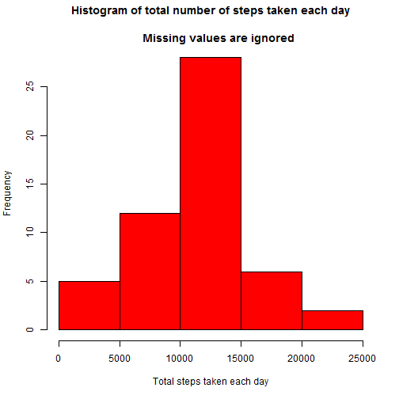
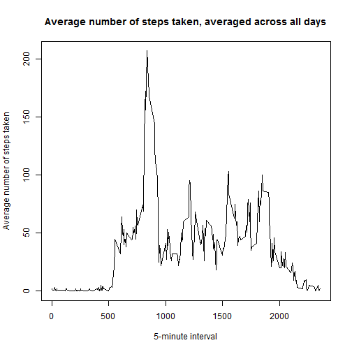
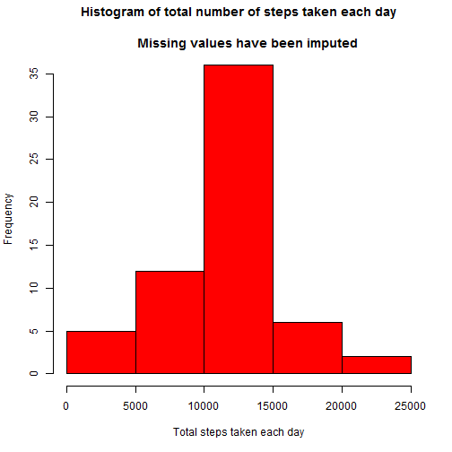
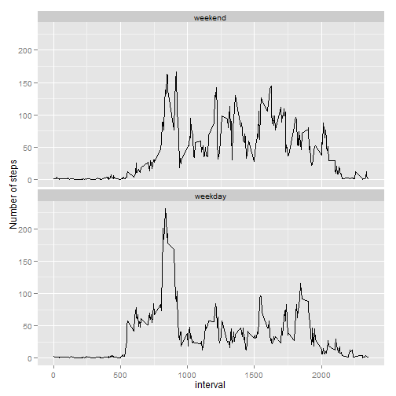

# Reproducible Research: Peer Assessment 1  


## Loading and preprocessing the data  


```r
zipUrl <- "https://d396qusza40orc.cloudfront.net/repdata%2Fdata%2Factivity.zip"

if (!file.exists("activity.zip")) {
        download.file(zipUrl, destfile = "./activity.zip",method = "internal", mode="wb")        
} ## download activity.zip if it does not exist in current working directory
```

1. Load the data (i.e. read.csv())  


```r
activityunz <- unz("./activity.zip","activity.csv")

activity <- read.csv(activityunz, header=TRUE) 
```

2. Process/transform the data (if necessary) into a format suitable for your analysis  


```r
Sys.setlocale("LC_TIME", "English") ## change locale to English
```

```
## [1] "English_United States.1252"
```

```r
activity$date <- as.Date(activity$date) ## change date in Date format

str(activity)
```

```
## 'data.frame':	17568 obs. of  3 variables:
##  $ steps   : int  NA NA NA NA NA NA NA NA NA NA ...
##  $ date    : Date, format: "2012-10-01" "2012-10-01" ...
##  $ interval: int  0 5 10 15 20 25 30 35 40 45 ...
```

## What is mean total number of steps taken per day?  

1. Make a histogram of the total number of steps taken each day  


```r
library(plyr)

activitywithoutnas <- activity[!is.na(activity$steps),] ## ignore NAs

totalstepsperday <- ddply(activitywithoutnas, .(date),
                          summarize, totalsteps = sum(steps, na.rm=TRUE))

hist(totalstepsperday$totalsteps,
     col = 2,
     main = "Histogram of total number of steps taken each day\n
     Missing values are ignored",
     xlab = "Total steps taken each day")
```

 

2. Calculate and report the **mean** and **median** total number of steps taken per day  


```r
meanoftotalstepsperday <- as.integer(ceiling(mean(totalstepsperday$totalsteps, na.rm=FALSE)))

medianoftotalstepsperday <- as.integer(median(totalstepsperday$totalsteps, na.rm=FALSE))
```
The **mean**  total number of steps taken each day ignoring missing values is **10767**  

The **median** total number of steps taken each day ignoring missing values is **10765**  


## What is the average daily activity pattern?

1.Make a time series plot (i.e. type = "l") of the 5-minute interval (x-axis) and the average number of steps taken, averaged across all days (y-axis)  


```r
library(plyr)

## Calculate the average number of steps taken in the 5-minute interval, averaged across all days 

meanstepsperinterval <- ddply(activity, .(interval),
                              summarize, meansteps = ceiling(mean(steps, na.rm=TRUE)))


with(meanstepsperinterval, {
        plot(interval, meansteps, 
             type = "l",
             xlab = "5-minute interval",
             ylab = "Average number of steps taken",
             main = "Average number of steps taken, averaged across all days")
})
```

 

2. Which 5-minute interval, on average across all the days in the dataset, contains the maximum number of steps?  


```r
## compute the 5-minute interval, on average across all the days in the dataset, that contains the maximum number of steps  

intervalformaximumnumberofsteps <- meanstepsperinterval$interval[
        which.max(meanstepsperinterval$meansteps)]
```
The **5-minute interval**, on average across all the days in the dataset, that contains the maximum number of steps is **835**  

## Imputing missing values  

1. Calculate and report the total number of missing values in the dataset (i.e. the total number of rows with NAs)


```r
nas <- is.na(activity$steps)

totalnas <- sum(nas)
```
The **total number of missing values** in the data set is **2304**  

2. Devise a strategy for filling in all of the missing values in the dataset. The strategy does not need to be sophisticated. For example, you could use the mean/median for that day, or the mean for that 5-minute interval, etc.  

We will use the **average number of steps taken in the 5-minute interval**, averaged across all days **for filling all the missing values**  

3. Create a new dataset that is equal to the original dataset but with the missing data filled in.  


```r
library(plyr)

activityfilled <- activity

indexofnas <- which(is.na(activityfilled$steps), arr.ind = TRUE)

intervalsofnas <- data.frame(index = indexofnas,
                             interval = activityfilled$interval[indexofnas])

meanstepsofnas <- arrange(join(intervalsofnas, meanstepsperinterval), index)
```

```
## Joining by: interval
```

```r
activityfilled$steps[indexofnas] <- meanstepsofnas$meansteps
```
4. Make a histogram of the total number of steps taken each day and Calculate and report the mean and median total number of steps taken per day. Do these values differ from the estimates from the first part of the assignment? What is the impact of imputing missing data on the estimates of the total daily number of steps?  


```r
library(plyr)

totalstepsperday <- ddply(activityfilled, .(date), summarize, totalsteps = sum(steps, na.rm=TRUE))

hist(totalstepsperday$totalsteps,
     col = 2,
     main = "Histogram of total number of steps taken each day\n
     Missing values have been imputed",
     xlab = "Total steps taken each day")
```

 

```r
meanoftotalstepsperdayf <- as.integer(ceiling(mean(totalstepsperday$totalsteps, na.rm=FALSE)))

medianoftotalstepsperdayf <- as.integer(ceiling(median(totalstepsperday$totalsteps, na.rm=FALSE)))
```
The **mean**  total number of steps taken each day imputing missing values is **10785**  

The **difference** with the estimate of the **mean** ignoring missing values is **18**  

The **median** total number of steps taken each day imputing missing values is **10909**  

The **difference** with the estimate of the **median** ignoring missing values is **144**  

## Are there differences in activity patterns between weekdays and weekends?  

1.Create a new factor variable in the dataset with two levels - "weekday" and "weekend" indicating whether a given date is a weekday or weekend day  


```r
Sys.setlocale("LC_TIME", "English") ## change locale to English
```

```
## [1] "English_United States.1252"
```

```r
activityfilled$weekday <-  as.factor(ifelse(weekdays(activityfilled$date) %in% 
                                                    c("Saturday","Sunday"),
                                            "weekend", "weekday"))

activityfilled$weekday <- relevel(activityfilled$weekday, "weekend")
```

2. Make a panel plot containing a time series plot (i.e. type = "l") of the 5-minute interval (x-axis) and the average number of steps taken, averaged across all weekday days or weekend days (y-axis)  


```r
library(plyr)

## Calculate the average number of steps taken in the 5-minute interval, averaged across all days
## or weekend days 

meanstepsperinterval <- ddply(activityfilled, .(weekday, interval),
                              summarize, meansteps = ceiling(mean(steps, na.rm=TRUE)))


## plot the data using ggplot2

library(ggplot2)

## initial call to ggplot , build the aesthetics

g <- ggplot(meanstepsperinterval, aes(interval, meansteps))

## add a geom for the points

g <- g + geom_line()

## add facets

g <- g + facet_wrap("weekday", nrow = 2)

## modify y label

g <- g + ylab("Number of steps")

print(g)
```

 
